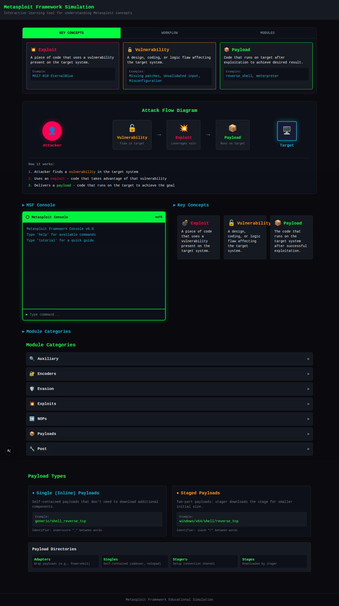

# Metasploit Framework Simulation

An interactive educational tool for learning Metasploit Framework concepts.

## Features

- **Interactive Console**: Practice MSF console commands (help, show, use, info, search, run)
- **Help Bar**: Quick reference for Key Concepts, Workflow, and Module types
- **Attack Flow Diagram**: Visual diagram showing Exploit → Vulnerability → Payload relationship
- **Module Explorer**: Browse all 7 module categories
- **Concept Cards**: Interactive explanations of Exploit, Vulnerability, Payload
- **Payload Types**: Understand Single vs Staged payloads

## Getting Started

```bash
# Clone the repository
git clone https://github.com/AbdurRahman-cybersec/metasploit-simulation.git
cd metasploit-simulation

# Install dependencies
npm install

# Run the development server
npm run dev
```

Open [http://localhost:3000](http://localhost:3000) in your browser.

## Commands Available

- `help` - Show available commands
- `show [category]` - Display modules (auxiliary, encoders, evasion, exploits, nops, payloads, post)
- `use [module]` - Select a module
- `info` - Show module details
- `options` - Show module options
- `set [option] [value]` - Set module option
- `search [term]` - Search modules
- `run` - Execute module
- `tutorial` - Quick tutorial
- `clear` - Clear console
- `back` - Exit module context

## Screenshots



## Tech Stack

- Next.js 16
- React
- Tailwind CSS
- TypeScript
